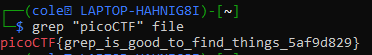

# PicoCTF First Grep Challenge Writeup
## Introduction
This challenge provides a txt file with a mess of jumbled words and characters. The challenge hints that the flag is hidden somewhere among the characters, and the name of the challenge suggests that grep can be used to search for the flag inside the file. 
## Find the Flag
As the name of the challenge suggests, the flag can easily be recovered by searching for the keyword "picoCTF" inside the file using grep: 
  