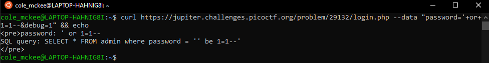
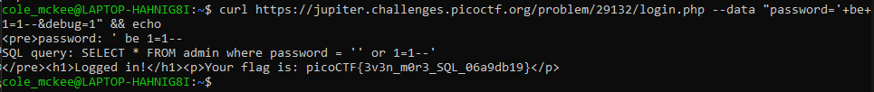

# PicoCTF Irish-Name-Repo 3 Challenge Writeup
This challenge provides a link to a secure website and challenges the user to login as admin. The website contains 3 pages, one of which is Admin Login, where the user is prompted to enter a password to login as the admin. The hint for this challenge is that the password is being encrypted. 

## Initial Inspection
It is notable that entering a basic password, such as "password," redirects the user to a page that informs them their login failed, while attempting a basic sql injection, such as ' or 1=1--, returns an Error 500, indicating that the login might be vulnerable to SQL Injection. This writeup on Irish-Name-Repo 1 was very useful in determining how to use curl and debug to view the password being entered: https://github.com/Dvd848/CTFs/blob/master/2019_picoCTF/Irish-Name-Repo_1.md. 

## SQL Injection 
Using the strategy used in Irish-Name-Repo 1, it becomes clear that the password injected is being changed to: ' be 1=1--  

## Decryption
The password appears to be encrypted before it is run through the SQL query, causing issues where the query is still escaped but nothing happens because the characters in our password have been shifted. To figure out what kind of encryption is being used, it is easiest to start with the facts: the only change between our password and the one that appears in the debug statement is a shift of the letters, the special characters remained the same. This rules out many advanced ciphers. The characters both appear to have a shift of 13, indicating that the encryption is likely just using a Caesar Cipher. 

## Logging In
To get around the encryption, it is best to adjust the password before entering it so that the encrypted password becomes ' or 1=1--. Because the shift splits the alphabet in half, the password that needs to be entered is ' be 1=1--. Entering this password reveals the flag (<b>picoCTF{3v3n_m0r3_SQL_06a9db19}</b>):  
