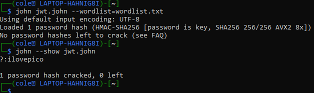

# PicoCTF JaWT Scratchpad Challenge Writeup
## Introduction
This challenge provides a webpage that allows the user to enter a name and generate their own scratchpad; however, the user is banned from entering the name "admin." On the webpage, regestering with the name john is reccomended. The name john contains a hyperlink to John the Ripper, hinting that part of the challenge will require using John the Ripper to crack something. 
## Inspect Element
Using the developer tools on Google Chrome, it can be observed that a cookie named jwt is generated after entering a name for the scratchpad. A quick websearch of jwt reveals that the cookie is a JSON web token. https://jwt.io/ is a useful website for decoding the jwt. Using this website, the data in the given jwt is decoded as: 
    
The only data in the payload is the user's name. As stated previously, the website will not allow the user to enter the name "admin". However, changing the name in the payload of the jwt and then entering that cookie into the developer tools will enable us to use "admin" as our name for the webpage. 
## Decoding the 256 bit secret 
Before the payload of the token can be edited, the secret key must be cracked in order to create a new, valid token. John the Ripper is required for this process  
The following sources proved very useful in determing how to crack the jwt using John: 
* https://security.stackexchange.com/questions/134200/cracking-a-jwt-signature
* https://blog.pentesteracademy.com/hacking-jwt-tokens-bruteforcing-weak-signing-key-johntheripper-89f0c7e6a87
* https://github.com/praetorian-inc/Hob0Rules/blob/master/wordlists/rockyou.txt.gz 

The jwt can be cracked by running a brute forcing algorithm with a wordlist:
    
As the image above details, the secret key for the token is: "ilovepico"  
The secret key can be used on jwt.io to create a new, valid token with the username set to "admin":
    
## Retrieving the Flag
Finally, the new token can be inserted into the web browser using developer tools. Afterwards, a refresh of the webpage reveals the flag: <b>picoCTF{jawt_was_just_what_you_thought_1ca14548}</b>