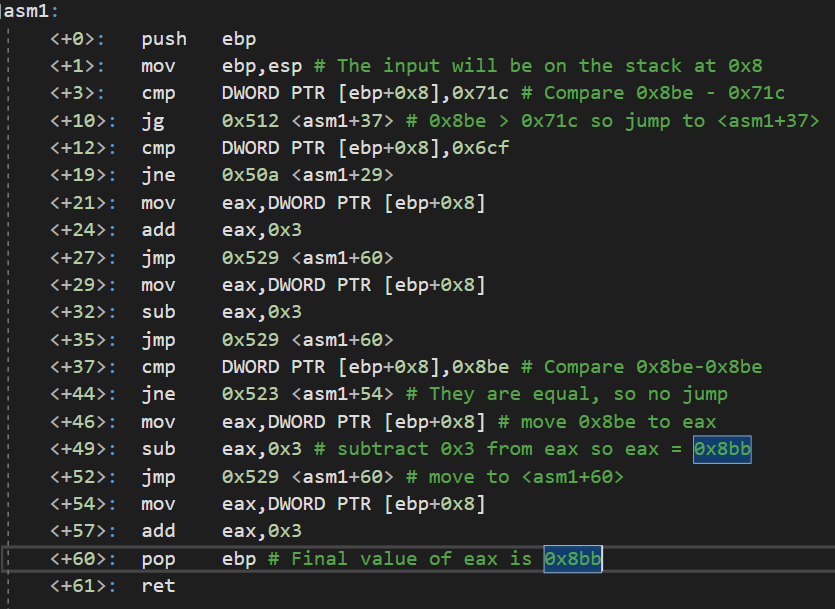

# PicoCTF asm1 Challenge Writeup
## Introduction
This challenge provides an assembly program (asm1) and asks for the output of asm1(0x8be). All numbers used in this challenge are in hexadecimal. All sourced referenced to solve this challenge are listed at the end of this writeup.
## Determining the Ouptut
I found that the easiest way to solve this problem was to go through it line by line to determine the final output of 0x8bb. The following image is the program provided with comments that explain the code:

## Sources Utilized: 
* https://www.tutorialspoint.com/assembly_programming/assembly_conditions.htm
* https://www.youtube.com/watch?v=wLXIWKUWpSs
* https://www.tenouk.com/Bufferoverflowc/Bufferoverflow4.html
* https://stackoverflow.com/questions/9617877/assembly-jg-jnle-jl-jnge-after-cmp