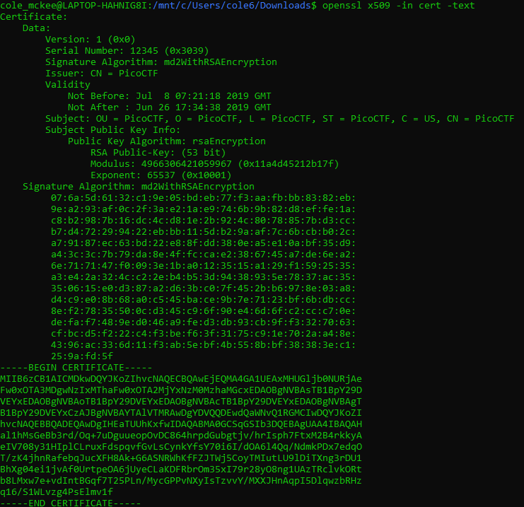

# PicoCTF John_Pollard Challenge Writeup
## Introduction
This challenge provides an RSA certificate and requests the flag in the format picoCTF{p, q}. Research on John Pollard concluded that Pollard's Rho algorithm can be utilized to determine the values of p and q given n. The following website was used to learn about Pollard's Rho Algorithm and then to retrieve a python script to extract the p and q from n: https://www.geeksforgeeks.org/pollards-rho-algorithm-prime-factorization/  
Additionally, a stackexchange was used to determine how to extract data from the certificate given in the challenge: https://crypto.stackexchange.com/questions/43696/extract-data-from-certificate

## Extracting the Public Key
According to the stackexchange, openssl can be used to extrace the public key in the certificate to retrieve n as 4966306421059967: 

## Calculating p and q
Finally, p and q can be calculated using the pollard.py script found in the same directory as this writeup. After running n = 4966306421059967 through the script, the values come out to be p = 73176001 and q = 67867967, so the flag is <b>picoCTF{73176001,67867967}</b>.
